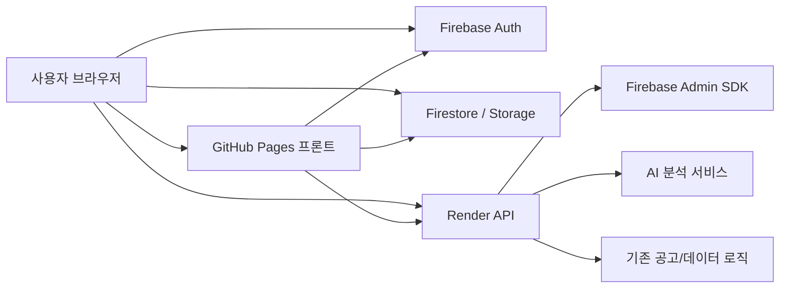

# Firebase 인증 및 제출 저장 구조 설계서

## 1. 문서 목적

이 문서는 `Portfolio Coach`에 아래 요구사항을 추가하기 위한 설계 문서다.

- 아무나 서비스 기능을 남용하지 못하도록 로그인 추가
- 로그인한 사용자의 포트폴리오/서류 제출을 DB에 저장
- 관리자가 제출물과 상태를 따로 확인할 수 있는 구조 설계
- 현재 운영 중인 `GitHub Pages + Render` 구조를 최대한 유지
- 비용을 가능한 한 낮게 유지

이 문서는 구현 전 기준 문서다.  
즉시 코드를 바꾸기 위한 설명이 아니라, 이후 실제 구현 시 기준으로 삼는 설계와 체크리스트를 담는다.

---

## 2. 현재 시스템 상태

현재 배포 구조:

- Frontend: GitHub Pages
- Backend: Render Web Service
- 공고 데이터: 정적 JSON + Render API
- AI 분석: Render API 및 일부 Supabase `gemini-proxy` 경유

현재 문제:

1. 로그인/권한 개념이 없다.
2. 비용이 드는 AI 기능에 대해 사용자 식별이 없다.
3. 누가 어떤 분석을 얼마나 쓰는지 추적이 어렵다.
4. 사용자가 제출한 포트폴리오/서류를 구조적으로 적재하는 저장소가 없다.
5. 관리자가 제출 결과를 별도 화면에서 확인하는 기능이 없다.

즉, 지금 상태는 “도구형 웹앱”이고, 앞으로는 “로그인 기반 운영형 서비스”로 바뀌어야 한다.

---

## 3. 설계 목표

### 핵심 목표

1. 로그인하지 않은 사용자는 핵심 기능을 사용할 수 없게 한다.
2. 비용이 드는 AI 호출은 서버 측 인증 뒤에서만 실행되게 한다.
3. 사용자가 제출한 자료를 DB/파일 스토리지에 남긴다.
4. 관리자는 제출 현황을 따로 볼 수 있다.
5. 무료 또는 저비용 구간 안에서 운영 가능해야 한다.

### 비목표

이번 단계에서 바로 하지 않는 것:

- 공개 회원가입
- 소셜 로그인
- 결제 시스템
- 역할 기반 복잡 권한 매트릭스
- 실시간 채팅/알림
- 제출물 버전 비교 화면

---

## 4. 왜 Firebase를 쓰는가

### 선택 이유

Firebase를 쓰는 이유는 다음과 같다.

1. GitHub Pages 정적 프론트와 궁합이 좋다.
2. 이메일/비밀번호 로그인만 붙이는 경우 설정이 단순하다.
3. Firestore + Storage 조합으로 제출 메타데이터와 파일을 분리 저장하기 좋다.
4. 초기 무료 구간이 비교적 넉넉하다.
5. Render 백엔드에서 Firebase Admin SDK로 토큰 검증을 붙이기 쉽다.

### 비용 전략

Spark 무료 플랜 기준에서 시작한다.

Firebase 공식 문서:

- 가격: [Firebase Pricing](https://firebase.google.com/pricing)
- 이메일/비밀번호 로그인: [Firebase Auth Web Password](https://firebase.google.com/docs/auth/web/password-auth)

현재 설계에서 무료 구간 안에 맞추려는 방향:

- 공개 회원가입 없음
- 운영자가 계정을 직접 발급
- 사용자당 제출 횟수 제한
- 사용자당 AI 호출 횟수 제한
- 첨부 파일 개수와 크기 제한

---

## 5. 최종 아키텍처



### 역할 분리

#### GitHub Pages

- 로그인 UI
- 사용자 입력 화면
- 제출 화면
- 관리자 제출 목록 화면

#### Firebase Auth

- 이메일/비밀번호 로그인
- 세션 유지

#### Firestore

- 사용자 메타데이터
- 제출 기록
- 상태값
- 관리자 메모

#### Firebase Storage

- 이력서 PDF
- 자기소개서 PDF
- 포트폴리오 PDF

#### Render

- Firebase ID 토큰 검증
- AI 분석 API 보호
- 관리자 API 보호
- 기존 분석/추천/기업 정보 API 보호

---

## 6. 사용자 유형

### 6.1 일반 사용자

가능:

- 로그인
- 본인 프로필 작성
- 파일 업로드
- 포트폴리오 제출
- 내 제출 상태 확인
- AI 분석 사용

불가:

- 타인 제출 열람
- 관리자 메모 열람
- 상태 변경
- 수동 크롤링
- 관리자 API 호출

### 6.2 관리자

가능:

- 전체 제출 목록 열람
- 제출 상세 열람
- 상태 변경
- 메모 작성
- 제출 필터링
- 필요 시 사용자 계정 비활성화

---

## 7. 인증 정책

### 7.1 로그인 방식

- Firebase Authentication
- Email/Password only
- 공개 회원가입 UI 없음
- 계정은 운영자가 Firebase Console에서 생성

이유:

- 남용 방지에 직접적
- 비용 통제 쉬움
- 초기 운영 단순

### 7.2 세션 정책

- Firebase Web SDK의 로그인 세션 유지 사용
- 새로고침 후 세션 복원
- 토큰 만료 시 재로그인 유도

### 7.3 권한 정책

권장 role:

- `user`
- `admin`

권한 판별 위치:

1. 클라이언트: UI 분기용
2. Firestore Rules: 데이터 접근 통제용
3. Render 백엔드: API 통제용

가장 중요한 기준은 3번이다.  
UI만 숨겨도 API가 열려 있으면 의미가 없다.

---

## 8. Firebase 프로젝트 설정 체크리스트

## 8.1 Authentication

활성화:

- Email/Password

비활성화:

- Google
- Anonymous
- Phone
- GitHub
- 기타 소셜 로그인

### 8.2 Firestore

생성 컬렉션:

- `users`
- `portfolioSubmissions`
- `submissionEvents` 선택
- `usageLogs` 선택

### 8.3 Storage

권장 기본 경로:

```text
portfolio-submissions/{uid}/{submissionId}/...
```

---

## 9. Firestore 데이터 모델

## 9.1 users

문서 경로:

```text
users/{uid}
```

예시:

```json
{
  "email": "user@example.com",
  "displayName": "양윤석",
  "role": "user",
  "trackDefault": "기획",
  "createdAt": "2026-05-14T00:00:00.000Z",
  "lastLoginAt": "2026-05-14T09:00:00.000Z",
  "active": true
}
```

필드 설명:

- `role`: user/admin 구분
- `trackDefault`: 기본 진입 트랙
- `active`: 계정 차단용

## 9.2 portfolioSubmissions

문서 경로:

```text
portfolioSubmissions/{submissionId}
```

예시:

```json
{
  "userId": "firebase-uid",
  "userEmail": "user@example.com",
  "applicantName": "양윤석",
  "track": "기획",
  "subRole": "시스템/컨텐츠 기획",
  "experience": 0,
  "title": "1차 포트폴리오 제출",
  "summary": "이력서, 자기소개서, 포트폴리오 제출",
  "skills": [
    { "name": "시스템/컨텐츠 기획", "level": "중" }
  ],
  "githubUrl": "",
  "resumeFileUrl": "https://...",
  "coverLetterFileUrl": "https://...",
  "portfolioFileUrls": [
    "https://..."
  ],
  "status": "submitted",
  "adminMemo": "",
  "createdAt": "2026-05-14T09:10:00.000Z",
  "updatedAt": "2026-05-14T09:10:00.000Z",
  "latestAnalysisSummary": "",
  "latestRecommendedJobsSnapshot": []
}
```

### 권장 status 값

- `submitted`
- `reviewing`
- `reviewed`
- `rejected`

## 9.3 submissionEvents 선택

문서 경로:

```text
submissionEvents/{eventId}
```

예시:

```json
{
  "submissionId": "sub_123",
  "actorId": "admin_uid",
  "actorRole": "admin",
  "type": "status_changed",
  "from": "submitted",
  "to": "reviewing",
  "note": "1차 검토 시작",
  "createdAt": "2026-05-14T10:00:00.000Z"
}
```

이 컬렉션은 필수는 아니다.  
하지만 운영 이력 추적이 필요하면 넣는 편이 좋다.

---

## 10. Storage 경로 설계

```text
portfolio-submissions/{uid}/{submissionId}/resume.pdf
portfolio-submissions/{uid}/{submissionId}/cover-letter.pdf
portfolio-submissions/{uid}/{submissionId}/portfolio-1.pdf
portfolio-submissions/{uid}/{submissionId}/portfolio-2.pdf
```

원칙:

- 사용자별 분리
- 제출 단위 분리
- 파일 이름 규칙 고정

추가 제한:

- PDF만 허용
- 파일당 최대 10MB
- 포트폴리오 파일 최대 5개

---

## 11. 보호 대상 API

## 11.1 반드시 로그인 필요

- `POST /api/analyze`
- `POST /api/analyze-personality`
- 추천 공고 AI 매칭
- 기업 정보 AI 조회
- 공고 분석 AI 요약
- 제출 생성/수정 API
- 관리자 제출 조회 API

## 11.2 공개 유지 가능

- `GET /api/models`
- `GET /api/prompts/interview-basic`
- 정적 공고 JSON
- 공고 메타데이터
- 히스토리 JSON

즉, 읽기 전용 시장 데이터는 공개 유지 가능하지만,  
비용이 드는 AI 호출과 제출은 인증 뒤로 가야 한다.

---

## 12. 현재 구조에서 반드시 바꿔야 하는 점

현재 프론트는 일부 AI 호출을 직접 Supabase `gemini-proxy`로 보내고 있다.

대표 예:

- `src/lib/gemini-client.js`
- `src/hooks/useApplicationAnalysis.js`
- `src/components/JobAnalysisWorkspace.jsx`
- `src/App.jsx`

이 구조는 인증 도입 시 문제가 된다.  
이유:

1. 프론트에서 직접 AI 프록시를 호출하면 서버 인증을 건너뛸 수 있다.
2. 로그인 UI가 있어도 API를 직접 호출하면 남용을 완전히 막지 못한다.

### 결론

AI 호출은 최종적으로 Render 백엔드 경유로 통합해야 한다.

즉:

- 프론트 -> Render API
- Render API -> Firebase 토큰 검증
- Render API -> Supabase gemini-proxy 또는 기존 AI provider 호출

이 경로가 최종 목표다.

---

## 13. Render 서버 설계

## 13.1 추가 패키지

권장:

- `firebase-admin`

## 13.2 환경변수

필수:

- `FIREBASE_PROJECT_ID`
- `FIREBASE_CLIENT_EMAIL`
- `FIREBASE_PRIVATE_KEY`

선택:

- `FIREBASE_STORAGE_BUCKET`

주의:

- `FIREBASE_PRIVATE_KEY`는 줄바꿈 이스케이프 처리 필요
- 절대 프론트에 넣지 않는다

## 13.3 미들웨어

추가 예정 미들웨어:

- `requireAuth`
- `requireAdmin`

동작:

1. `Authorization: Bearer <firebase-id-token>` 추출
2. Firebase Admin SDK로 verify
3. `req.user`에 사용자 정보 저장
4. 관리자 API는 Firestore `users/{uid}`의 role 확인

---

## 14. Firestore 보안 규칙 초안

```javascript
rules_version = '2';
service cloud.firestore {
  match /databases/{database}/documents {

    function isSignedIn() {
      return request.auth != null;
    }

    function isOwner(userId) {
      return isSignedIn() && request.auth.uid == userId;
    }

    function isAdmin() {
      return isSignedIn() &&
        exists(/databases/$(database)/documents/users/$(request.auth.uid)) &&
        get(/databases/$(database)/documents/users/$(request.auth.uid)).data.role == "admin";
    }

    match /users/{userId} {
      allow create: if isOwner(userId);
      allow read, update: if isOwner(userId) || isAdmin();
      allow delete: if false;
    }

    match /portfolioSubmissions/{submissionId} {
      allow create: if isSignedIn() &&
        request.resource.data.userId == request.auth.uid;

      allow read: if isSignedIn() &&
        (resource.data.userId == request.auth.uid || isAdmin());

      allow update: if isSignedIn() &&
        (resource.data.userId == request.auth.uid || isAdmin());

      allow delete: if false;
    }

    match /submissionEvents/{eventId} {
      allow read: if isAdmin();
      allow create: if isAdmin();
      allow update, delete: if false;
    }
  }
}
```

실제 구현 시에는 일반 사용자가 수정 가능한 필드를 더 좁혀야 한다.  
예: `status`, `adminMemo`는 사용자 수정 금지.

---

## 15. Storage 보안 규칙 초안

```javascript
rules_version = '2';
service firebase.storage {
  match /b/{bucket}/o {
    match /portfolio-submissions/{userId}/{submissionId}/{fileName} {
      allow write: if request.auth != null
        && request.auth.uid == userId;

      allow read: if request.auth != null
        && request.auth.uid == userId;
    }
  }
}
```

초기 버전은 이 정도로 단순하게 가져가도 된다.  
관리자 열람은 직접 Storage Rules에서 열지 말고, Render 백엔드 중계로 여는 방식이 더 안전하다.

---

## 16. 프론트 화면 설계

## 16.1 로그인 화면

필수 요소:

- 이메일
- 비밀번호
- 로그인 버튼
- 비밀번호 재설정 링크
- “계정은 관리자에게 요청” 안내

제외:

- 회원가입 버튼
- 소셜 로그인

## 16.2 로그인 이후

기존 트랙 선택 게이트는 유지 가능하다.  
단, 로그인 완료 후에만 진입하도록 한다.

## 16.3 제출하기 화면

신규 메뉴 제안:

- `제출하기`

구성:

- 제출 제목
- 제출 요약
- 현재 프로필 미리보기
- 파일 업로드
- 제출 버튼

## 16.4 내 제출 내역

신규 메뉴 제안:

- `내 제출 내역`

구성:

- 제출일
- 트랙
- 상태
- 파일 수
- 관리자 메모 여부
- 다시 열기

## 16.5 관리자 제출 목록

경로 예시:

- `/admin/submissions`

구성:

- 목록 테이블
- 상태 필터
- 트랙 필터
- 날짜 필터
- 상세 패널
- 관리자 메모 입력
- 상태 변경 버튼

---

## 17. 사용자 제한 정책

비용과 남용 방지를 위해 아래 제한을 둔다.

### 제출 제한

- 사용자당 하루 최대 3회 제출
- 제출당 파일 최대 7개
  - 이력서 1
  - 자기소개서 1
  - 포트폴리오 5

### 파일 제한

- PDF만 허용
- 파일당 최대 10MB

### AI 호출 제한

- 사용자당 하루 최대 10회 분석
- 추천 공고 매칭 하루 최대 10회
- 인성검사 AI 해석 하루 최대 5회

### 운영 방식

- 초과 시 사용자에게 명확한 에러 메시지 표시
- 관리자 계정은 별도 예외 정책 가능

---

## 18. 구현 단계

## 18.1 1차 목표

목표:

- 로그인 안 하면 앱 사용 불가
- 로그인 사용자만 AI 기능 사용 가능

작업:

- Firebase Auth 연결
- 로그인 화면 추가
- 세션 상태 관리
- Render에서 Firebase 토큰 검증
- `analyze`, `analyze-personality` 보호

## 18.2 2차 목표

목표:

- 포트폴리오/서류 제출 저장 가능

작업:

- Storage 업로드
- Firestore 메타데이터 저장
- 제출하기 화면
- 내 제출 목록 화면

## 18.3 3차 목표

목표:

- 관리자 확인 가능

작업:

- 관리자 목록 화면
- 상태 변경
- 메모 작성
- 필터링

## 18.4 4차 목표

목표:

- AI 호출 경로 완전 정리

작업:

- 프론트 직접 `gemini-proxy` 호출 제거
- Render 인증 경유로 통일

---

## 19. 작업 체크리스트

### Firebase Console

- [ ] Firebase 프로젝트 생성
- [ ] Authentication Email/Password 활성화
- [ ] Firestore 생성
- [ ] Storage 생성
- [ ] 관리자 계정 1개 생성

### 프론트

- [ ] Firebase Web SDK 추가
- [ ] 로그인 화면 추가
- [ ] 세션 상태 훅 추가
- [ ] 로그인 전 앱 접근 차단
- [ ] 제출하기 화면 추가
- [ ] 내 제출 내역 화면 추가

### 백엔드

- [ ] `firebase-admin` 추가
- [ ] Firebase Admin 초기화
- [ ] `requireAuth` 미들웨어
- [ ] `requireAdmin` 미들웨어
- [ ] 분석 API 보호
- [ ] 제출 API 추가
- [ ] 관리자 제출 API 추가

### 데이터

- [ ] Firestore rules 작성
- [ ] Storage rules 작성
- [ ] 제출 컬렉션 구조 확정
- [ ] 인덱스 필요 여부 점검

### 운영

- [ ] Render 환경변수 등록
- [ ] Firebase 설정값 프론트 환경변수 등록
- [ ] 관리자 계정 발급 절차 정리
- [ ] 호출 제한 정책 확정

---

## 20. 완료 기준

다음 조건을 만족하면 1차 완료로 본다.

1. 로그인하지 않으면 앱 주요 화면 접근 불가
2. `/api/analyze`, `/api/analyze-personality`가 토큰 없이 호출되면 실패
3. 로그인 사용자가 제출을 생성할 수 있음
4. 제출 메타데이터가 Firestore에 남음
5. 첨부 파일이 Storage에 저장됨
6. 관리자가 제출 목록을 별도 화면에서 볼 수 있음

---

## 21. 롤백 전략

문제 발생 시 롤백 순서:

1. 프론트 로그인 게이트 비활성화
2. 제출 화면 비노출
3. 서버 인증 미들웨어 제거 또는 feature flag off
4. 기존 공개 분석 구조로 임시 복귀

주의:

AI API 보호는 롤백해도 제출 저장 구조는 남을 수 있으므로,  
배포 전 단계별 브랜치/태그를 반드시 남긴다.

---

## 22. 기본 결론

현재 프로젝트에서 가장 현실적인 방향은 다음이다.

- 인증: Firebase Auth
- 파일 저장: Firebase Storage
- 제출 메타데이터: Firestore
- 기존 AI 서버: Render 유지
- 남용 방지: Render에서 Firebase 토큰 검증
- 회원가입: 공개하지 않음
- 계정 생성: 관리자 수동 생성
- 관리자 확인: 별도 관리자 화면

이 방식이면 비용을 가장 낮게 유지하면서도,  
“아무나 남용 못 하게 하고”, “제출물을 저장하고”, “관리자가 따로 확인하는 구조”를 만들 수 있다.

---

## 23. Replit 운영 전환 계획

### 23.1 전제

장기적으로 `GitHub Pages + Render` 대신 `Replit` 중심 운영으로 옮기고 싶다면,  
이번 Firebase 인증/제출 구조는 그 전환을 막지 않게 설계해야 한다.

핵심 원칙:

1. 인증과 데이터 저장은 Firebase에 둔다.
2. 앱 서버는 Render에서 시작하되, 나중에 Replit로 옮길 수 있게 한다.
3. 프론트와 백엔드의 배포 경계를 문서화해 둔다.

즉, 지금 해야 하는 설계는 “Render 고정”이 아니라 “서버 런타임 교체 가능” 구조여야 한다.

### 23.2 Replit에서 가능한 배포 방식

Replit 공식 문서 기준으로 주요 배포 타입은 다음과 같다.

- `Static Deployment`
- `Autoscale Deployment`
- `Reserved VM Deployment`
- `Scheduled Deployment`

공식 참고:

- Deployments 개요: [Replit Deployments](https://docs.replit.com/cloud-services/deployments)
- 커스텀 도메인: [Replit Custom Domains](https://docs.replit.com/cloud-services/deployments/custom-domains)
- 배포 모니터링: [Monitoring a Deployment](https://docs.replit.com/cloud-services/deployments/monitoring-a-deployment)
- App 구성 및 `.replit`: [Replit App Configuration](https://docs.replit.com/replit-app/configuration)

### 23.3 이 프로젝트에 맞는 Replit 배포 후보

#### 안 A. 프론트/백 분리 유지

- 프론트: Replit Static Deployment
- 백엔드: Replit Autoscale 또는 Reserved VM
- 인증/DB/파일: Firebase

장점:

- 현재 구조와 가장 비슷하다
- 리스크가 낮다
- 정적 프론트와 API 서버를 독립적으로 관리 가능

단점:

- 서비스가 둘로 나뉜다
- 프론트와 백엔드 배포를 각각 관리해야 한다

#### 안 B. 단일 Replit 서버로 통합

- 하나의 Node 서버가 `dist` 정적 파일 + API를 같이 서빙
- 배포 타입: Replit Autoscale 또는 Reserved VM
- 인증/DB/파일: Firebase

장점:

- 운영 경로가 단순해진다
- 도메인/배포 포인트가 하나가 된다
- GitHub Pages를 제거할 수 있다

단점:

- 현재 정적 배포 구조를 바꿔야 한다
- 서버 장애 시 프론트와 API가 같이 영향받는다

### 23.4 추천 방향

처음 Replit로 옮길 때는 `안 A`가 더 안전하다.

즉:

1. Firebase 인증/제출 구조 먼저 완성
2. Render 백엔드를 Replit API 서버로 대체
3. 그 다음 필요하면 GitHub Pages 프론트도 Replit Static 또는 통합 서버로 이전

이유:

- 한번에 모든 런타임을 바꾸면 원인 분리가 어렵다
- 인증, 제출 저장, AI API 보호가 먼저 안정화되어야 한다
- 프론트와 백엔드를 나눠 옮기면 롤백이 쉽다

### 23.5 Replit 전환 시 주의할 점

Replit 문서상 배포는 타입별로 운영 특성이 다르다. 특히 아래를 미리 고려해야 한다.

1. 포트 바인딩
   - 서버는 `0.0.0.0`에 바인딩해야 한다
2. 환경변수/Secrets
   - Firebase 키, 서버 키, 디스코드 웹훅 모두 Replit Secrets로 이동 필요
3. 영구 저장소 의존 금지
   - 앱 내부 디스크를 영구 데이터 저장소로 가정하지 않는다
   - 제출 파일과 메타데이터는 계속 Firebase에 둔다
4. 스케줄 작업 분리
   - 현재 일일 크롤링은 GitHub Actions 기반
   - 나중에 Replit로 옮길 경우 `Scheduled Deployment` 또는 외부 스케줄러 검토

### 23.6 현재 구조에서 Replit 전환을 위해 미리 지켜야 할 규칙

#### 규칙 1. 상태 저장은 서버 로컬 파일에 의존하지 않는다

지금도 제출 데이터는 Firebase로 넣을 계획이다.  
이 원칙을 유지하면 Replit로 옮겨도 이전 비용이 낮다.

#### 규칙 2. API Base URL은 환경변수로만 관리한다

프론트는 계속 아래 방식 유지:

- `VITE_API_BASE_URL`
- `VITE_SUPABASE_URL`

즉, 배포 대상이 Render에서 Replit로 바뀌어도 코드 수정 없이 환경값만 바꿀 수 있어야 한다.

#### 규칙 3. 서버 인증은 런타임 비종속적으로 구현한다

`firebase-admin` 검증 로직은 Render 전용이 아니라 Node 서버 공통 코드로 작성한다.

즉:

- Express 미들웨어
- 환경변수 기반 초기화
- 런타임에 종속적인 파일 경로 최소화

#### 규칙 4. 일일 크롤링은 배포 플랫폼과 분리된 작업으로 본다

현재는 GitHub Actions가 더 단순하고 안정적이다.  
Replit 전환 후에도 즉시 옮기지 말고, 먼저 서비스 서버만 이전하는 편이 낫다.

### 23.7 단계별 Replit 이전 로드맵

#### 단계 1. 지금

- GitHub Pages 유지
- Render 유지
- Firebase Auth/Firestore/Storage 도입

#### 단계 2. 인증 안정화 후

- Render 백엔드를 Replit Autoscale 또는 Reserved VM으로 대체 검토
- API 정상 동작, 토큰 검증, 파일 저장 확인

#### 단계 3. 이후

- 프론트를 계속 GitHub Pages에 둘지
- Replit Static Deployment로 옮길지
- 단일 Replit 서버에 통합할지 결정

#### 단계 4. 마지막

- 필요 시 일일 크롤링 스케줄도 Replit Scheduled Deployment 검토
- 단, 초기에는 GitHub Actions 유지 권장

### 23.8 Replit 전환 시 체크리스트

- [ ] 서버가 `0.0.0.0` 포트 바인딩으로 동작하는지 확인
- [ ] `.replit` 또는 Replit Deployment 설정 정리
- [ ] Firebase Secrets를 Replit Secrets로 이전
- [ ] API Base URL을 Replit 도메인으로 교체
- [ ] 커스텀 도메인 연결 여부 결정
- [ ] Replit Deployment 타입 결정
- [ ] 제출 업로드와 관리자 API가 정상 작동하는지 검증
- [ ] 기존 GitHub Pages / Render 롤백 경로 유지

### 23.9 최종 판단

장기적으로 Replit 운영은 충분히 가능하다.  
다만 순서는 다음이 맞다.

1. Firebase 인증/제출 구조 완성
2. AI API 보호 완성
3. Render 서버를 Replit로 이전
4. 필요하면 프론트도 Replit로 이전

즉, `Firebase 도입`과 `Replit 이전`은 충돌하지 않는다.  
오히려 Firebase를 먼저 넣어두면 배포 플랫폼을 바꾸더라도 데이터와 인증 계층은 그대로 유지할 수 있다.

