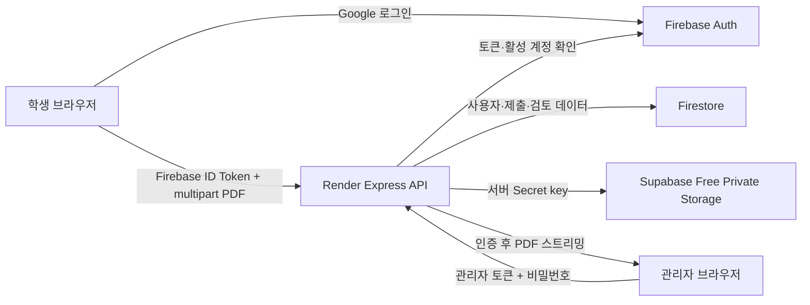
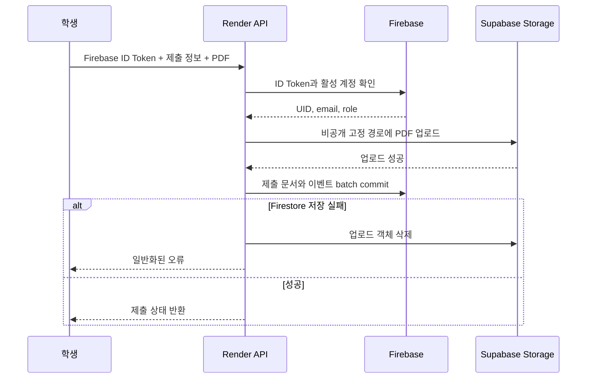

# Portfolio Coach 인증·제출 아키텍처

## 1. 목표

- Google 로그인한 활성 사용자만 기능을 사용한다.
- 학생 PDF는 공개 URL 없이 비공개 저장한다.
- 학생 제출과 관리자 검토 데이터를 명확히 분리한다.
- Firebase와 Render의 기존 운영 구조를 유지한다.
- 파일 저장은 결제 수단이 필요 없는 무료 구간으로 운영한다.

## 2. 현재 구성



- 프론트·API: Render Web Service
- 인증: Firebase Authentication
- 데이터베이스: Firestore
- 파일: Supabase Free 비공개 버킷
- 코드: GitHub 비공개 저장소
- 공고 크롤링: GitHub Actions와 Render API

Firebase Storage는 Blaze 요금제를 요구하므로 사용하지 않는다. Render 무료 인스턴스의 로컬 파일 시스템은 재배포·재시작·유휴 중지 때 사라지므로 영구 파일 저장소로 사용하지 않는다.

## 3. 보안 경계

### 브라우저

브라우저가 보유하는 값:

- Firebase 공개 클라이언트 설정
- Firebase ID 토큰
- 사용자가 선택한 로컬 PDF

브라우저가 받지 않는 값:

- Firebase 서비스 계정 키
- Supabase Secret key
- 관리자 메모
- Supabase 객체 경로
- 영구 다운로드 URL

### Render API

Render API가 담당하는 작업:

1. Firebase ID 토큰 검증
2. Firestore 사용자 `active` 및 `role` 확인
3. 제출 운영 플래그와 Supabase 버킷 상태 확인
4. 멀티파트 파일 수·크기·PDF 헤더 검증
5. 사용자 UID와 제출 ID에 고정된 객체 경로 생성
6. Supabase 비공개 버킷 업로드
7. Firestore 제출·이벤트 배치 저장
8. Firestore 실패 시 업로드 객체 롤백
9. 관리자 권한 확인 후 PDF 프록시 다운로드

### Supabase

- 버킷은 Private 상태여야 한다.
- Secret key는 Render에서만 사용한다.
- 클라이언트는 Supabase API를 직접 호출하지 않는다.
- 버킷이 공개 상태면 `/api/capabilities`가 제출 기능을 비활성화한다.
- 업로드는 `upsert: false`로 기존 파일 덮어쓰기를 방지한다.

서버용 `sb_secret_...` 키를 사용하며 레거시 `service_role` 키는 호환 목적으로만 허용한다.

## 4. 제출 흐름



고정 객체 경로:

```text
portfolio-submissions/{uid}/{submissionId}/resume.pdf
portfolio-submissions/{uid}/{submissionId}/cover-letter.pdf
portfolio-submissions/{uid}/{submissionId}/portfolio-1.pdf
...
portfolio-submissions/{uid}/{submissionId}/portfolio-5.pdf
```

제한:

- 이력서 최대 1개
- 자기소개서 최대 1개
- 포트폴리오 최대 5개
- 파일당 최대 10MB
- PDF 헤더 `%PDF-` 확인
- 사용자별 동시 제출 최대 1개

## 5. 관리자 다운로드 흐름

1. 관리자 Firebase 토큰을 폐기 여부까지 확인한다.
2. `users/{uid}.role == admin`과 `active == true`를 확인한다.
3. 관리자 모드 비밀번호를 별도로 확인한다.
4. 제출 문서에서 요청한 파일 키를 조회한다.
5. `userId`, `submissionId`, 고정 파일명이 모두 경로와 일치하는지 확인한다.
6. Render 서버가 Supabase 비공개 객체를 가져와 스트리밍한다.
7. 응답에 `Cache-Control: private, no-store`와 `X-Content-Type-Options: nosniff`를 적용한다.

지원 파일 키:

- `resume`
- `coverLetter`
- `portfolio-1`부터 `portfolio-5`

학생 API는 `storagePath`, `adminMemo`, `reviewedByEmail`을 반환하지 않는다.

## 6. Firestore 모델

### `users/{uid}`

- `email`
- `displayName`
- `studentName`
- `role`: `user | admin`
- `active`: `boolean`
- `trackDefault`
- 로그인·이름 변경 시각

### `portfolioSubmissions/{submissionId}`

- 사용자: `userId`, `userEmail`, `accountStudentName`, `applicantName`
- 진로: `track`, `subRole`, `experience`, `skills`, `githubUrl`
- 제출: `status`, `submittedAtIso`, `fileCounts`, `files`
- 분석 스냅샷: `latestAnalysisSummary`, `latestRecommendedJobsSnapshot`
- 관리자 전용: `adminMemo`, `reviewedBy`, `reviewedByEmail`
- 학생 공개: `studentFeedback`, `studentFeedbackUpdatedAtIso`

상태:

- `submitted`: 확인 필요
- `reviewing`: 검토 중
- `reviewed`: 검토 완료
- `rejected`: 보완 후 재제출 필요

### 이벤트

- `submissionEvents`: 제출 생성, 파일 업로드, 관리자 검토 변경
- `userAccessEvents`: 계정 활성화·중지

브라우저의 제출 컬렉션 직접 읽기·쓰기는 Firestore Rules에서 모두 거부한다. Render의 Firebase Admin SDK만 해당 컬렉션을 처리한다.

## 7. API

학생:

- `GET /api/me/submissions`
- `POST /api/me/submissions`

관리자:

- `POST /api/admin/unlock`
- `GET /api/admin/overview`
- `PATCH /api/admin/submissions/:submissionId`
- `GET /api/admin/submissions/:submissionId/files/:fileKey`
- `PATCH /api/admin/users/:uid`

운영 상태:

- `GET /api/capabilities`

제출 기능은 다음 조건을 모두 만족해야 `ready`가 된다.

1. `PORTFOLIO_UPLOADS_ENABLED=true`
2. `SUPABASE_STORAGE_URL` 설정
3. `SUPABASE_STORAGE_SECRET_KEY` 설정
4. 지정 버킷 존재
5. 버킷이 Private
6. Supabase API 접근 성공

## 8. 무료 운영 제약

Supabase Free 기준:

- 파일 저장 1GB
- 월 egress 5GB
- 비활성 프로젝트 일시 중지 가능
- 결제 수단을 등록하지 않은 Free 조직 사용

운영자는 관리자 화면과 Supabase Dashboard에서 사용량을 확인하고, 한도에 가까워지면 오래된 제출물을 별도 백업 후 정리한다. 무료 구간 초과 시 자동 유료 전환을 허용하지 않는다.

## 9. 장애와 롤백

신규 제출 차단:

```text
PORTFOLIO_UPLOADS_ENABLED=false
```

이 값은 기존 제출 조회와 관리자 검토를 유지하면서 신규 업로드만 닫는다.

실패 처리:

- 버킷 미설정: `admin_not_configured`
- 버킷 없음: `bucket_missing`
- 버킷 공개: `bucket_public`
- API 장애: `storage_unavailable`
- 모든 준비 완료: `ready`

운영 상태 응답은 `Cache-Control: no-store`로 제공한다.

## 10. 검증 기준

- 로그인하지 않은 제출·관리자 API가 `401`
- 비활성 계정이 `403`
- 공개 버킷에서 제출 비활성
- 확장자가 PDF여도 PDF 헤더가 없으면 거부
- 10MB 초과 파일 거부
- Firestore 저장 실패 시 Supabase 객체 삭제
- 관리자만 PDF 다운로드 가능
- 학생 응답에서 내부 필드와 객체 경로 제외
- `npm run verify` 통과
- Render 배포 후 실제 제출·검토·다운로드 확인
